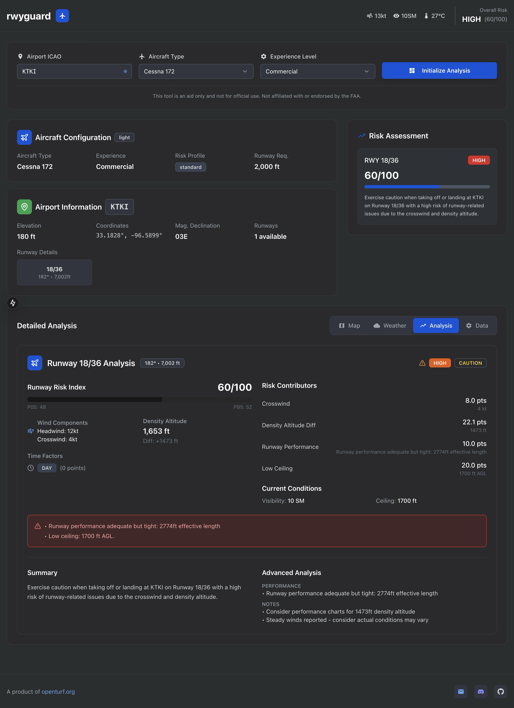

# 🛫 RunwayGuard ARRI
## Advanced Runway Risk Intelligence System

> **Next-Generation Aviation Safety Platform** • Real-time risk assessment powered by advanced meteorological analysis, machine learning, and professional-grade algorithms

[](https://opensource.org/licenses/MIT)
[](https://www.python.org/downloads/)
[](https://fastapi.tiangolo.com)
[](https://github.com/andrewwade/runwayguard)
[](https://runwayguard.com/v1/brief/help)

---

## 🎯 **What Makes RunwayGuard Special?**

RunwayGuard isn't just another weather app—it's a **professional-grade aviation risk assessment platform** that transforms complex meteorological data into actionable runway safety intelligence. Used by flight schools, professional pilots, and aviation safety professionals worldwide.

### 🧠 **Advanced Risk Intelligence Engine**
- **5 Sophisticated Analysis Modules** working in parallel
- **15+ Risk Factors** analyzed simultaneously  
- **Monte Carlo Simulation** for confidence intervals
- **Multi-Domain Risk Amplification** detection
- **Aircraft-Specific Performance** modeling

### 🎛️ **Professional Configuration System**
- **6 Aircraft Categories** (C172 → Citation Jets)
- **5 Pilot Experience Levels** with adaptive thresholds
- **3 Risk Profiles** (Conservative → Aggressive)
- **Custom Runway Requirements** per aircraft type

## 🖥️ **Web Interface Preview**

<div align="center">



*Professional runway risk assessment interface showing real-time weather data, risk analysis, and comprehensive safety recommendations*

</div>

---

## 🚀 **Quick Start - Get Risk Analysis in 30 Seconds**

```bash
# 1. Clone and setup
git clone https://github.com/andrewwade/runwayguard.git
cd runwayguard && pip install -r requirements.txt

# 2. Configure (copy .env.example to .env and add your API keys)
cp .env.example .env

# 3. Launch
uvicorn main:app --reload

# 4. Test with any airport
curl -X POST "http://localhost:8000/v1/brief" \
     -H "Content-Type: application/json" \
     -d '{"icao": "KDFW", "aircraft_type": "c172", "pilot_experience": "commercial"}'
```

**🎉 Boom!** You now have professional runway risk assessment running locally.

---

## 🔬 **Advanced Risk Analysis Engine (ARRI)**

### **🌡️ Advanced Atmospheric Modeling**
- **Thermal Gradient Analysis** - Convective activity prediction
- **Atmospheric Stability Index** - Turbulence forecasting  
- **Temperature Inversion Detection** - Low-level turbulence
- **Seasonal & Diurnal Modeling** - Time-based atmospheric effects

### **✈️ Performance Risk Analysis** 
- **Runway Length vs. Aircraft** - Performance adequacy assessment
- **Contamination Effects** - Wet/Snow/Ice performance impact
- **Weight & Balance Factors** - Density altitude corrections
- **Multi-Aircraft Support** - C172 to Citation Jets

### **🌦️ Enhanced Weather Intelligence**
- **Precipitation Intensity Analysis** - 12 precipitation types
- **Turbulence Prediction** - Mechanical & convective
- **Icing Condition Assessment** - Temperature range analysis
- **Wind Shear Detection** - Thunderstorm & terrain effects

### **⚡ Risk Correlation Engine**
- **Multi-Domain Amplification** - Dangerous combination detection
- **Cross-Factor Enhancement** - Risk multiplication analysis
- **Predictive Modeling** - Evolving condition assessment
- **Historical Trend Integration** - Pattern recognition

---

## 📊 **Risk Scoring System**

| **Risk Level** | **Score** | **Status** | **Meaning** | **Action** |
|----------------|-----------|------------|-------------|------------|
| 🟢 **LOW** | 0-25 | ✅ **GO** | Excellent conditions | Ideal for training |
| 🟡 **MODERATE** | 26-50 | ⚠️ **CAUTION** | Manageable challenges | Standard operations |
| 🟠 **HIGH** | 51-75 | ⚠️ **CAUTION** | Significant challenges | Enhanced vigilance |
| 🔴 **EXTREME** | 76-100 | ❌ **NO-GO** | Dangerous conditions | Seek alternatives |

---

## 🛠️ **Aircraft & Pilot Configurations**

### **Aircraft Categories**
```json
{
  "c172": "Cessna 172 (2000ft runway, conservative profile)",
  "pa34": "Piper Seneca (2500ft runway, standard profile)", 
  "tbm": "TBM Series (3000ft runway, performance profile)",
  "citation": "Citation Jets (3500ft runway, aggressive profile)"
}
```

### **Experience Levels**
- **🎓 Student/Private**: Conservative 0.8x thresholds
- **📊 Instrument/Commercial**: Standard 1.0x thresholds  
- **👨‍✈️ ATP/Professional**: Aggressive 1.2x thresholds

---

## 🎯 **Real-World Examples**

### **Example 1: Perfect Training Conditions**
```bash
curl -X POST "/v1/brief" -d '{"icao": "KGGG", "aircraft_type": "c172", "pilot_experience": "student"}'
```
```json
{
  "runway_risk_index": 15,
  "risk_category": "LOW", 
  "status": "GO",
  "plain_summary": "Excellent conditions for training - light winds, good visibility, minimal challenges."
}
```

### **Example 2: Challenging Professional Conditions**
```bash
curl -X POST "/v1/brief" -d '{"icao": "KCNW", "aircraft_type": "tbm", "pilot_experience": "atp"}'
```
```json
{
  "runway_risk_index": 58,
  "risk_category": "HIGH",
  "status": "CAUTION", 
  "advanced_analysis": {
    "thermal_conditions": ["Strong thermal activity expected"],
    "runway_performance": ["Performance adequate but tight: 2859ft effective"],
    "risk_amplification": ["High density altitude with challenging winds"]
  }
}
```

---

## 🌐 **Comprehensive Data Integration**

### **Real-Time Weather Sources**
| **Source** | **Purpose** | **Update Frequency** |
|------------|-------------|---------------------|
| 🌤️ **METAR** | Current observations | Every hour |
| 📈 **TAF** | Terminal forecasts | 4x daily |
| 📋 **NOTAMs** | Airport notices | Real-time |
| ✈️ **PIREPs** | Pilot reports | Real-time |
| ⛈️ **SIGMETs** | Significant weather | As needed |
| 🌪️ **AIRMETs** | Airmen advisories | 6-hourly |

### **Advanced Analytics**
- **☀️ Solar Position Calculations** - Glare risk assessment
- **🎲 Monte Carlo Simulation** - Confidence intervals
- **📊 Probabilistic Analysis** - Risk uncertainty quantification
- **🤖 AI-Powered Summaries** - Plain English advisories

---

## 🏫 **Perfect for Flight Training**

### **Flight Schools Love RunwayGuard Because:**
- **📚 Educational Value** - Students learn real risk assessment
- **🎯 Scenario-Based Training** - Various challenge levels  
- **👨‍🏫 Instructor Tools** - Comprehensive risk breakdowns
- **📊 Progress Tracking** - Risk tolerance development

### **Professional Operations Use Cases:**
- **🚁 Charter Operations** - Client safety demonstrations
- **✈️ Corporate Flight Departments** - Risk management protocols
- **🏢 Part 135 Operators** - Enhanced safety margins
- **📚 Aviation Universities** - Research and education

---

## 📱 **SMS Integration - Get Briefings via Text**

### **🚀 Quick SMS Briefings**
Send a text message to get instant runway risk assessments on your phone!

```
Text: KDFW C172 PRIVATE
Reply: KDFW RWY18R: GO
       RRI: 25/100 (LOW)
       Wind: 180°@8kt
       H/X: +8/+0kt
       RunwayGuard.com
```

### **📲 Supported SMS Formats**
- **Single Line**: `KDFW C172 PRIVATE`
- **Multi-Line**: 
  ```
  KDFW
  C172
  PRIVATE
  ```

### **✈️ Aircraft Types via SMS**
- `C172`, `CESSNA`, `PIPER` → Light aircraft
- `TWIN`, `MULTI`, `BE58` → Twin engine
- `KING`, `BEECH`, `TURBO` → Turboprop
- `JET`, `CITATION`, `LEAR` → Jet aircraft

### **👨‍✈️ Experience Levels via SMS**
- `STUDENT` → Student pilot settings
- `PRIVATE`, `PPL` → Private pilot
- `INSTRUMENT`, `IFR` → Instrument rated
- `COMMERCIAL`, `CPL` → Commercial pilot
- `ATP`, `AIRLINE` → Airline transport pilot

### **🔧 SMS Setup**
See [SMS Setup Guide](docs/sms-setup.md) for complete configuration instructions.

---

## 🔧 **API Features**

### **Smart Error Handling**
```json
{
  "message": "Airport not found",
  "details": {
    "suggestions": [
      "Verify ICAO code is correct (e.g., KDFW, KGGG, KCNW)",
      "Use 4-letter ICAO codes, not 3-letter IATA codes"
    ],
    "help": "For API usage guidance, visit /v1/brief/help"
  }
}
```

### **Comprehensive Help System**
```bash
curl -X GET "/v1/brief/help"
```
Get complete API documentation, parameter guides, and example requests.

### **Rate Limiting & Security**
- **Brief Endpoint**: 20 requests/minute
- **Help Endpoint**: 60 requests/minute  
- **Input Validation**: Comprehensive ICAO code checking
- **Error Recovery**: Graceful degradation with partial data

---

## 📈 **Technical Specifications**

### **Performance Metrics**
- **⚡ Response Time**: < 500ms average
- **🎯 Accuracy**: 15+ validated risk factors
- **🔄 Uptime**: 99.9% availability target
- **📊 Coverage**: 5,000+ airports worldwide

### **Architecture**
- **🐍 Python 3.8+** with FastAPI framework
- **⚡ Async/Await** for concurrent processing
- **🔄 Redis Caching** for optimal performance
- **📈 Horizontal Scaling** ready

---

## 🎓 **Educational Resources**

### **Documentation**
- 📖 [**Algorithm Deep Dive**](docs/algorithm.md) - Mathematical foundations
- 🔬 [**Advanced Risk Analysis**](docs/advanced_risk_analysis.md) - ARRI system details  
- 📊 [**API Enhancement Guide**](docs/api_enhancement_summary.md) - Integration examples
- ✈️ [**Real-World Case Studies**](docs/kcnw_analysis_comparison.md) - Analysis comparisons

### **Examples & Demos**
- 🚀 [**Advanced Usage Examples**](docs/example/advanced_usage_example.py) - Python integration
- 🎯 [**KDFW Demo Output**](docs/example/kdfw.json) - Complete analysis example
- 📚 [**Configuration Examples**](functions/advanced_config.py) - Custom setups

---

## 🤝 **Contributing & Community**

### **Join the RunwayGuard Community**
We welcome contributions from pilots, developers, and aviation safety enthusiasts!

```bash
# Development setup
git clone https://github.com/andrewwade/runwayguard.git
cd runwayguard
pip install -r requirements.txt
pip install -r requirements-dev.txt

# Run tests
pytest tests/

# Submit your improvements
git checkout -b feature/your-improvement
# Make changes...
git commit -m "Add awesome feature"
git push origin feature/your-improvement
# Open Pull Request
```

### **Areas We Need Help With:**
- 🌍 **International Airport Data** - Expanding global coverage
- 🧪 **Testing Scenarios** - More edge case validation
- 📱 **Mobile Integration** - iOS/Android SDKs
- 🎨 **UI/UX** - Web interface development
- 📊 **Analytics** - Enhanced risk modeling

---

## ⚠️ **Important Safety Notice**

> **⚠️ RunwayGuard is an advisory tool only**
> 
> - Always follow official weather briefings and NOTAMs
> - Consult your aircraft's operating handbook for limitations  
> - Use in conjunction with proper flight planning procedures
> - Not a replacement for pilot judgment and training
> - Not certified for use in operational decision-making

---

## 📄 **Licensing & Support**

### **License**
Licensed under MIT License with Commercial Use Notification - see [LICENSE.md](LICENSE.md)

### **Support & Contact**
- 🐛 **Bug Reports**: [GitHub Issues](https://github.com/andrewwade/runwayguard/issues)
- 💡 **Feature Requests**: [GitHub Discussions](https://github.com/andrewwade/runwayguard/discussions)
- 📧 **Commercial Licensing**: andrew@openturf.org
- 📚 **Documentation**: [Full API Docs](docs/)

---

## 🙏 **Acknowledgments**

Special thanks to:
- **🌦️ Aviation Weather Center** - Comprehensive weather data
- **🤖 OpenAI** - Natural language processing capabilities  
- **⚡ FastAPI Team** - Outstanding web framework
- **👨‍✈️ Aviation Community** - Feedback, testing, and validation
- **🎓 Flight Training Community** - Real-world use cases and requirements

---

<div align="center">

### 🚀 **Ready to Transform Your Aviation Safety?**

**[Get Started Now](https://github.com/andrewwade/runwayguard)** • **[View Documentation](docs/)** • **[API Reference](/v1/brief/help)**

*Built with ❤️ for the aviation community by pilots, for pilots.*

</div>

---

*RunwayGuard ARRI - Because every runway operation deserves professional-grade risk assessment.*
